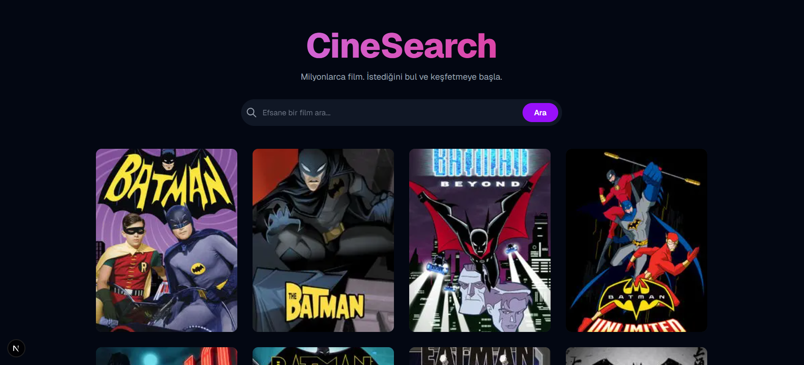
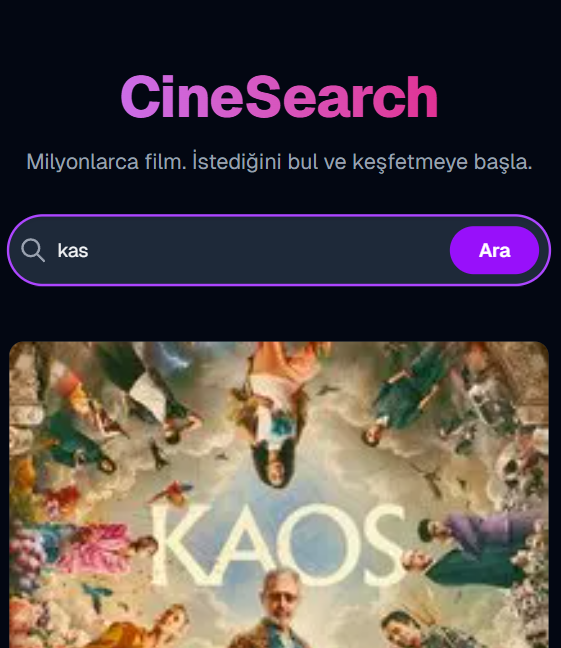
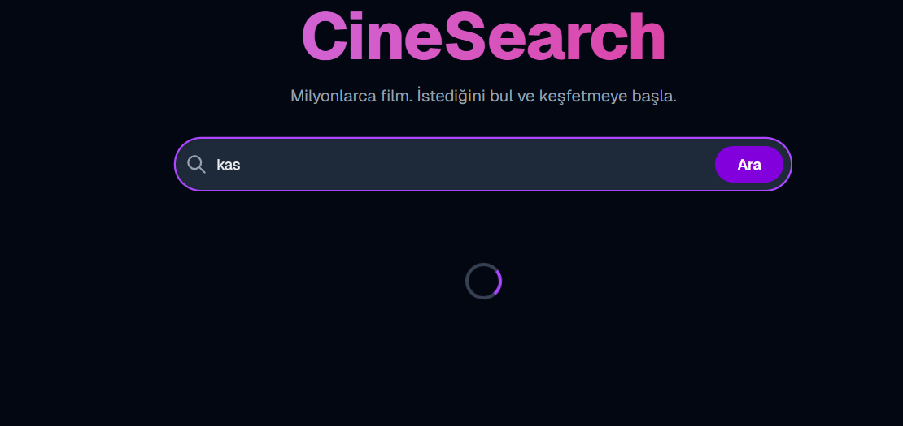
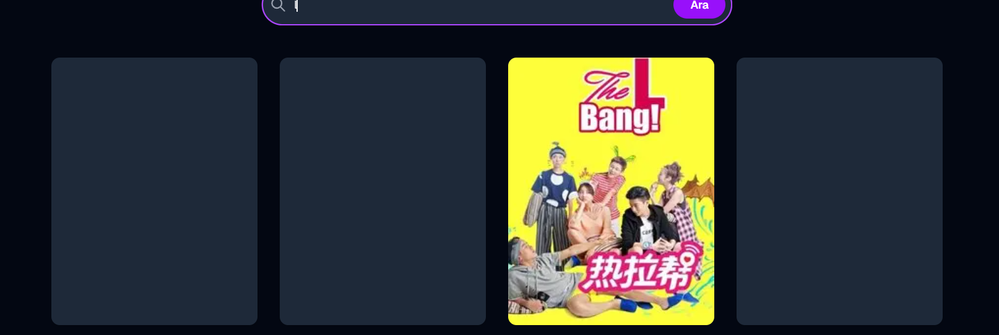
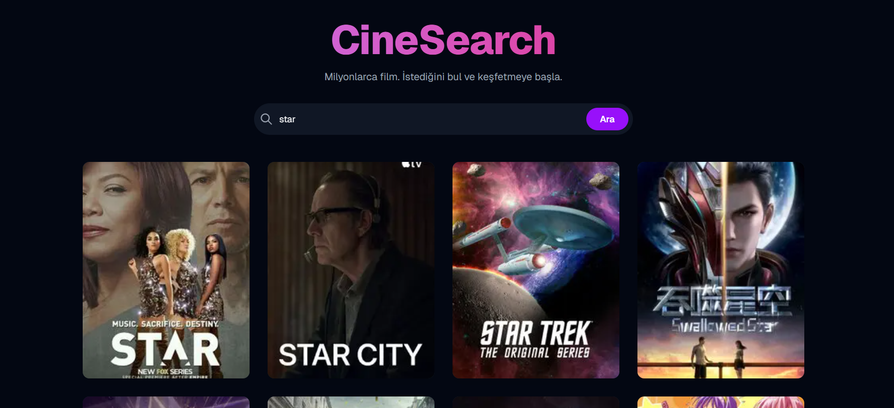
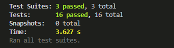

# 🎬 CineSearch - Movie Discovery App



CineSearch is a modern **Next.js** application that allows users to explore the world of movies and TV series. Powered by the TVMaze API, it offers real-time data fetching, a seamless user experience, and a highly responsive interface.
---

## 📍 Table of Contents
* [🚀 Key Features](#-key-features)
* [🛠️ Tech Stack](#️-tech-stack)
* [🎥 Demo & Visuals](#-demo--visuals)
* [🧪 Testing & Quality Assurance](#-testing--quality-assurance)
* [📦 Installation & Setup](#-installation--setup)
* [🔗 Contact](#-contact) 
  
---
## 🚀 Key Features

- **Dynamic Search:** Search through millions of shows and movies instantly.
- **Featured Content:** Automatically populated discovery area on the home page.
- **Modern UI/UX:** Built with Tailwind CSS, offering a fully responsive design for all devices.
- **Advanced Data Handling:** Secure management of complex API data (rating formatting, HTML summary sanitization, etc.).
- **Comprehensive Testing:** Critical components verified using Jest and React Testing Library.

## 🛠️ Tech Stack

- **Framework:** [Next.js 16 (App Router)](https://nextjs.org/)
- **Language:** [TypeScript](https://www.typescriptlang.org/)
- **Styling:** [Tailwind CSS](https://tailwindcss.com/)
- **Testing:** [Jest](https://jestjs.io/) & [React Testing Library](https://testing-library.com/)
- **API:** [TVMaze API](https://www.tvmaze.com/api)

## 🎥 Demo & Visuals
### Live Preview

 |---
[Live link](https://movie-app-liard-tau.vercel.app/)

### App Screenshots
| Mobile View | Loading & Skeleton | Search Experience |
|---|---|---|
|  |    |  |

## 🧪 Testing & Quality Assurance

To ensure logical correctness and a bug-free experience, the following areas are covered with unit and integration tests:

```bash
npm test
````

  - **MovieCard:** Tests for various rating formats and HTML summary stripping logic.
  - **SearchBox:** Verification of form submission and empty search prevention.
  - **Home Page:** Handling of API loading states and data integration.
  ---
  test result
  ---
  
  
## 📦 Installation & Setup

Follow these steps to run the project locally:

1.  **Clone the repository:**

    ```bash
    git clone [https://github.com/kasimugur/movie-app.git](https://github.com/kasimugur/movie-app.git)
    cd movie-app
    ```

2.  **Install dependencies:**

    ```bash
    npm install
    ```

3.  **Start the development server:**

    ```bash
    npm run dev
    ```

    Open `http://localhost:3000` in your browser to see the app.

-----
# 🔗 Contact
**Developed by Kasım Uğur** [GitHub](https://github.com/kasimugur/) | [LinkedIn](https://www.linkedin.com/in/kasimugur/)


